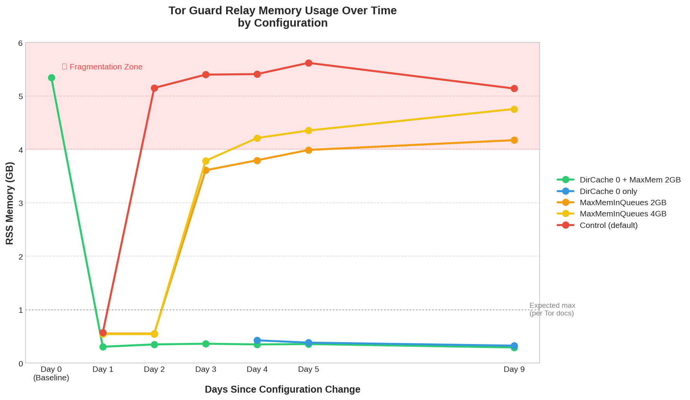

# The DirCache Dilemma: 94% Memory Reduction You Can't Use

**By 1AEO Team • January 2026**

In our hunt for the root cause of Tor memory bloat, we isolated the directory cache. Guard relays must cache and serve directory information—a process involving millions of tiny memory allocations and deallocations.

We tested a radical configuration: `DirCache 0`. The impact was immediate and dramatic.

## What We Found

| Configuration | Start RSS | End RSS | Change |
|--------------|-----------|---------|--------|
| DirCache 0 | — | 0.33 GB | **-93.8%** |
| Control (default) | 0.57 GB | 5.14 GB | +802% |

Memory remained stable for 9+ days with DirCache disabled—no fragmentation, no gradual creep.

## The Catch

There's no free lunch. Disabling DirCache instantly revokes your relay's Guard status. The network requires Guards to handle directory traffic, so you cannot turn this feature off to save RAM if you want to remain a Guard.

## The Diagnostic Value

This experiment was crucial. It proved that memory isn't "leaking" in the traditional sense—it's being **fragmented by the churn of directory data**. Since we can't turn DirCache off, we must fix how that data is stored in memory.

This pointed us directly to the solution: better allocators that handle fragmentation efficiently (see our allocator comparison).

---

*Data from 1AEO's guard relay investigation, September 2025*
