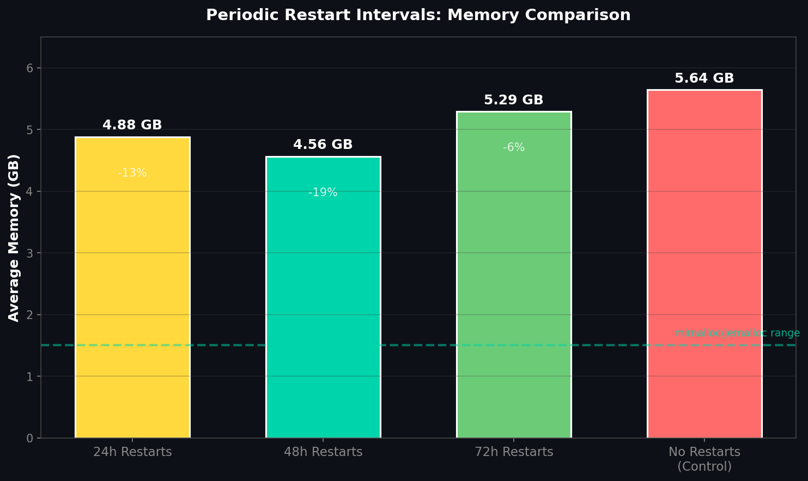

# Periodic Restarts: A Brute-Force Workaround

**By 1AEO Team • January 2026**

If you can't change your memory allocator, scheduled restarts offer a fallback strategy. We tested three restart intervals across 30 relays to measure effectiveness—and the tradeoffs.

## The Results

| Restart Interval | Avg Memory | vs Control | Tradeoff |
|-----------------|------------|------------|----------|
| Every 24 hours | 4.88 GB | -13% | High churn |
| Every 48 hours | 4.56 GB | -19% | Moderate |
| Every 72 hours | 5.29 GB | -6% | Low impact |
| Control (no restarts) | 5.64 GB | — | Baseline |



The 48-hour interval performed best, but even then memory averaged 4.56 GB—still 3-4x higher than what modern allocators achieve (1.1–1.6 GB).

## Why Restarts Help (A Little)

Restarting a Tor relay forces the process to release all memory back to the OS and start fresh. For the first 24-48 hours after restart, memory usage is reasonable. Then fragmentation kicks in and RSS climbs back toward 5+ GB.

The sawtooth pattern is predictable:
- **Hour 0:** Fresh start, ~500 MB
- **Hour 24:** Climbing, ~2-3 GB  
- **Hour 48:** Fragmented, ~4-5 GB
- **Hour 72+:** Plateau at 5+ GB

## The Tradeoffs

Scheduled restarts come with costs:

1. **Circuit disruption:** Active circuits are terminated, forcing clients to rebuild
2. **Warmup period:** Relay must re-establish connections and rebuild routing tables
3. **Operational overhead:** Requires cron/systemd timers and monitoring
4. **Diminishing returns:** 24h restarts only save ~13% vs no restarts

## Implementation

If you must use restarts, here's a systemd timer approach:

```bash
# Create timer: /etc/systemd/system/tor-restart@.timer
[Unit]
Description=Restart Tor relay %i every 48 hours

[Timer]
OnBootSec=48h
OnUnitActiveSec=48h
RandomizedDelaySec=1h

[Install]
WantedBy=timers.target
```

```bash
# Enable for a relay
sudo systemctl enable --now tor-restart@relay_name.timer
```

The `RandomizedDelaySec` staggers restarts across relays to avoid simultaneous disruption.

## When to Use Restarts

- **Temporary measure** while planning allocator migration
- **Constrained environments** where you can't install packages
- **Monitoring validation** to confirm memory returns to baseline

## Better Alternative

Restarts are a band-aid. Switching to mimalloc or jemalloc eliminates the need entirely—memory stays flat at 1-2 GB indefinitely without any service interruption.

| Approach | Memory | Service Impact |
|----------|--------|----------------|
| mimalloc 2.1 | 1.16 GB | None |
| jemalloc 5.3 | 1.63 GB | None |
| 48h restarts | 4.56 GB | Every 48 hours |
| No action | 5.64 GB | None (but wasted RAM) |

---

*Data from 1AEO's 90-relay memory experiment on Ubuntu 24.04, Dec 2025 – Jan 2026*

📊 **Raw data:** [View experiment data and relay configs on GitHub](https://github.com/1aeo/TorUtils/tree/main/memory/reports/2025-12-26-co-unified-memory-test)
