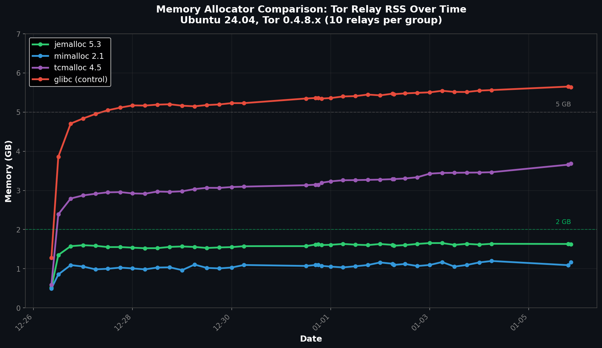

# Solving Tor Memory Fragmentation with Custom Allocators

*By 1AEO Team • January 2026*

*Experiment: 50 relays (10 per allocator group) over 10 days on Ubuntu 24.04 with Tor 0.4.8.21*

Running high-capacity Tor relays on Linux often leads to a familiar headache: memory that looks fine after restart, then "sticks" at 5–6 GB after ~48 hours. Our 100-relay experiment on **Ubuntu 24.04** with **Tor 0.4.8.21** confirms that the default system allocator (`glibc 2.39`) is the bottleneck—not Tor itself.

## The Results

The difference was stark. While glibc relays bloated to nearly 6 GB, relays using modern allocators remained stable:

| Allocator | Package (Ubuntu 24.04) | Avg Memory | Reduction |
|-----------|------------------------|------------|-----------|
| **mimalloc 2.1.2** | `libmimalloc2.0` | 1.16 GB | 80% |
| **jemalloc 5.3.0** | `libjemalloc2` | 1.59 GB | 72% |
| tcmalloc 2.15 | `libgoogle-perftools4` | 3.79 GB | 33% |
| mimalloc 3.0.1 | (compiled from source) | 4.39 GB | 23% |
| glibc 2.39 | (default) | 5.68 GB | — |



## Why Modern Allocators Work

Tor's directory cache creates millions of small allocations that glibc struggles to release back to the OS. Modern allocators like jemalloc and mimalloc handle this fragmentation pattern efficiently—returning memory promptly without the permanent RSS bloat.

## How to Deploy (Ubuntu 24.04)

The best part: no recompilation needed. A simple systemd override swaps the allocator:

```bash
# Install (Ubuntu 24.04)
sudo apt install libmimalloc2.0  # mimalloc 2.1.2
# Or: sudo apt install libjemalloc2  # jemalloc 5.3.0

# Enable per-relay
sudo systemctl edit tor@relay_name
```

Add the override:

```ini
[Service]
Environment="LD_PRELOAD=/usr/lib/x86_64-linux-gnu/libmimalloc.so.2"
```

For jemalloc, use: `/usr/lib/x86_64-linux-gnu/libjemalloc.so.2`

## Bottom Line

If you're running a Guard relay on Ubuntu 24.04, the single most effective optimization isn't in your `torrc`—it's swapping your allocator. We recommend **mimalloc 2.1.2** (best results, available via apt) or **jemalloc 5.3.0** (battle-tested in Firefox/Redis) to reclaim gigabytes of wasted RAM while maintaining Guard status and full bandwidth.

**Note on mimalloc 3.0.1:** The latest mimalloc shows higher memory usage in our tests so far (4.39 GB). This group was recently configured and may need more time to stabilize. We'll update results as the experiment continues.

📊 **Raw data:** [View experiment data and relay configs on GitHub](https://github.com/1aeo/TorUtils/tree/main/memory/reports/2025-12-26-co-unified-memory-test)
