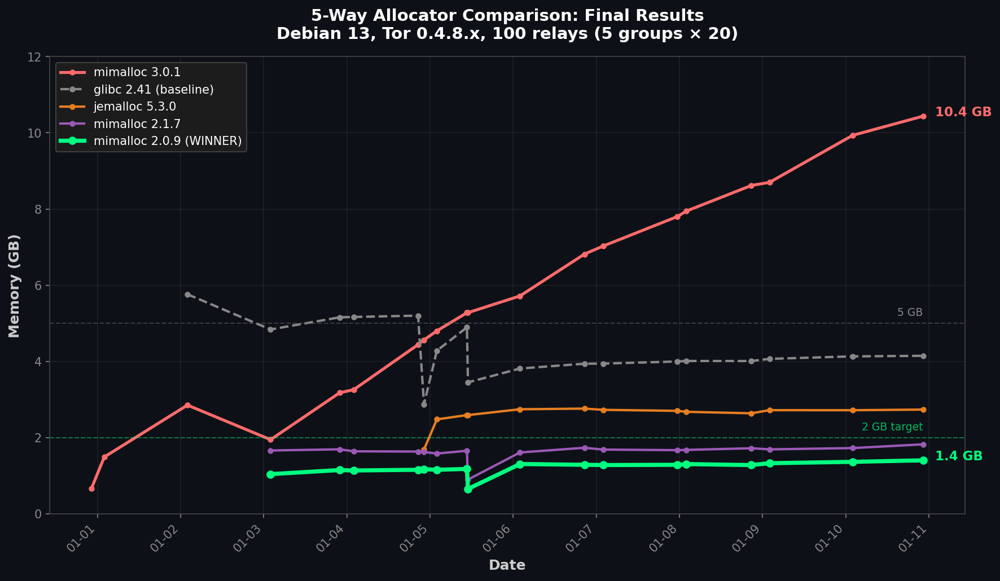

# Production Deployment: 200 Relays Migrated to mimalloc 2.0.9

*By 1AEO Team • January 2026*

*Experiment: 100 relays (5 groups × 20 relays) tested over 6-10 days on Debian 13 with Tor 0.4.8.x*

We ran a 5-way memory allocator comparison on 100 Tor relays, then migrated all 200 relays on the server to the winner: **mimalloc 2.0.9**.

## Experiment Setup

| Group | Allocator | Relays | Test Period | Duration |
|-------|-----------|--------|-------------|----------|
| A | mimalloc 3.0.1 | 20 | Dec 31 – Jan 10 | 10 days |
| B | mimalloc 2.0.9 | 20 | Jan 2 – Jan 10 | 8 days |
| C | mimalloc 2.1.7 | 20 | Jan 2 – Jan 10 | 8 days |
| D | jemalloc 5.3.0 | 20 | Jan 4 – Jan 10 | 6 days |
| E | glibc 2.41 | 20 | Jan 2 – Jan 10 | 8 days |

All 5 groups ran simultaneously from Jan 4–10 (6 days).

## Final Results (Jan 10, 2026)

| Allocator | Avg Memory | Ratio to 3.0.1 |
|-----------|------------|----------------|
| **mimalloc 2.0.9** | **1.41 GB** | **7.4× less** |
| mimalloc 2.1.7 | 1.83 GB | 5.7× less |
| jemalloc 5.3.0 | 2.74 GB | 3.8× less |
| glibc 2.41 | 4.15 GB | 2.5× less |
| mimalloc 3.0.1 | 10.44 GB | baseline |



## Key Observations

**mimalloc 3.0.1 regression:** Memory grew continuously over 10 days, reaching 10.44 GB with no sign of stabilizing.

**mimalloc 2.0.9 stable:** Memory stabilized around 1.4 GB by day 3 and remained flat.

**Version difference:** mimalloc 2.0.9 used 7.4× less memory than 3.0.1 on identical hardware and workload.

## Production Migration

Based on these results, we migrated all 200 relays on the server to mimalloc 2.0.9:

```bash
# Build mimalloc 2.0.9 from source
wget https://github.com/microsoft/mimalloc/archive/refs/tags/v2.0.9.tar.gz
tar xzf v2.0.9.tar.gz && cd mimalloc-2.0.9
mkdir build && cd build && cmake .. && make
sudo mkdir -p /usr/local/lib/mimalloc
sudo cp libmimalloc.so.2.0 /usr/local/lib/mimalloc/libmimalloc-2.0.9.so

# Configure all relays
for relay in $(ls /var/lib/tor-instances/); do
    sudo mkdir -p /etc/systemd/system/tor@${relay}.service.d/
    cat <<EOF | sudo tee /etc/systemd/system/tor@${relay}.service.d/allocator.conf
[Service]
Environment="LD_PRELOAD=/usr/local/lib/mimalloc/libmimalloc-2.0.9.so"
EOF
done
sudo systemctl daemon-reload
```

## Debian 13 Warning

The `libmimalloc2.0` package on Debian 13 ships **mimalloc 3.0.1**, which showed the regression. Build 2.0.9 from source.

## Data

📊 Raw data: [experiments/2026-01-08-5way-allocator-comparison](https://github.com/1aeo/TorUtils/tree/main/memory/experiments/2026-01-08-5way-allocator-comparison)
