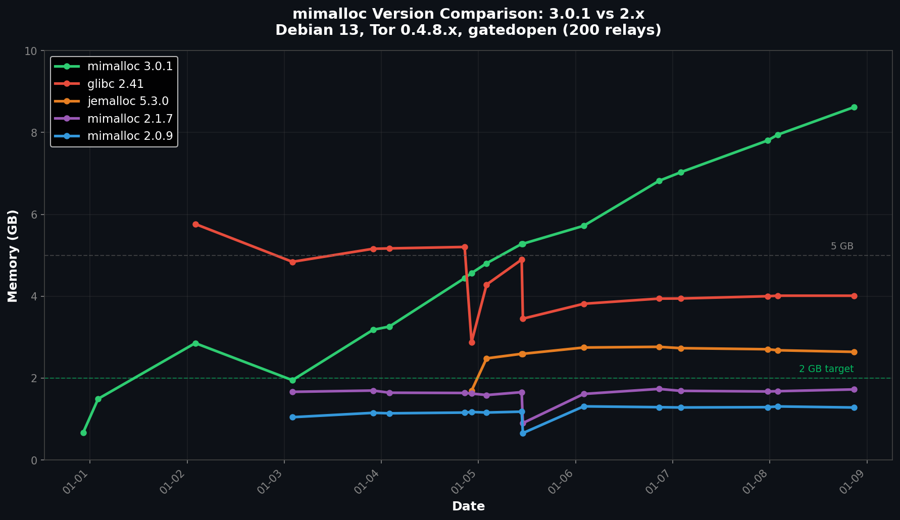

# mimalloc 3.0.1 Regression: Why Older is Better for Tor Relays

*By 1AEO Team • January 2026*

*Experiment: 200 relays (5 allocator groups) over 9 days on Debian 13 with Tor 0.4.8.x*

After discovering that mimalloc dramatically outperforms glibc for Tor relays, we assumed the latest version would be best. We were wrong. Our 200-relay experiment on **Debian 13** reveals that **mimalloc 3.0.1 has a severe regression**—using nearly 7x more memory than mimalloc 2.0.9.

## The Results

The version differences were dramatic. While mimalloc 2.0.9 stayed rock-solid at ~1.3 GB, version 3.0.1 ballooned to nearly 9 GB:

| Allocator | Avg Memory | vs glibc | vs 3.0.1 | Status |
|-----------|------------|----------|----------|--------|
| **mimalloc 2.0.9** | 1.28 GB | 68% less | 6.7x less | ✅ Stable |
| **mimalloc 2.1.7** | 1.72 GB | 57% less | 5.0x less | ✅ Stable |
| jemalloc 5.3.0 | 2.64 GB | 34% less | 3.3x less | ✅ Stable |
| glibc 2.41 | 4.01 GB | — | 2.1x less | 📈 Growing |
| mimalloc 3.0.1 | 8.62 GB | 115% more | — | ❌ Bloating |



## The Regression Pattern

mimalloc 3.0.1 showed clear pathological behavior:
- **Day 1:** Started at ~1.9 GB (normal)
- **Day 3:** Already at 3.3 GB (warning sign)
- **Day 5:** Reached 5.3 GB (matching glibc)
- **Day 9:** Hit 8.6 GB and still climbing (~1 GB/day)

Meanwhile, mimalloc 2.0.9 flatlined at 1.28 GB from Day 3 onward. This isn't gradual growth—it's a regression in how 3.x handles memory-intensive workloads like Tor's directory cache.

## Why 2.x Wins

The mimalloc 2.x series appears to return memory to the OS more aggressively. Changes in the 3.x architecture—likely related to segment management or arena strategies—seem to cause memory retention that's problematic for Tor's allocation patterns.

This isn't a Tor-specific bug; it's a mismatch between mimalloc 3.x's optimization targets (short-lived allocations, high throughput) and Tor's needs (long-running, many small allocations, memory efficiency).

## How to Deploy (Debian 13)

The Debian 13 package (`libmimalloc2.0`) ships mimalloc 3.0.1—**don't use it**. Instead, build 2.0.9:

```bash
# Build mimalloc 2.0.9
wget https://github.com/microsoft/mimalloc/archive/refs/tags/v2.0.9.tar.gz
tar xzf v2.0.9.tar.gz && cd mimalloc-2.0.9
mkdir build && cd build && cmake .. && make
sudo cp libmimalloc.so.2.0 /usr/local/lib/mimalloc/libmimalloc-2.0.9.so

# Enable per-relay
sudo mkdir -p /etc/systemd/system/tor@relay_name.service.d
sudo tee /etc/systemd/system/tor@relay_name.service.d/allocator.conf <<EOF
[Service]
Environment="LD_PRELOAD=/usr/local/lib/mimalloc/libmimalloc-2.0.9.so"
EOF
sudo systemctl daemon-reload && sudo systemctl restart tor@relay_name
```

## Bottom Line

Version numbers don't always mean better. For Tor relays on Debian 13:

1. **Use mimalloc 2.0.9** — Best results, most stable (1.28 GB)
2. **Avoid mimalloc 3.0.1** — Severe regression, grows unbounded
3. **jemalloc 5.3.0** — Good fallback available via `apt install libjemalloc2`

We're reporting this regression to the mimalloc team. Until it's addressed, stick with the 2.x series.

📊 **Raw data:** [View experiment data on GitHub](https://github.com/1aeo/TorUtils/tree/main/memory/experiments/2026-01-08-5way-allocator-comparison)

