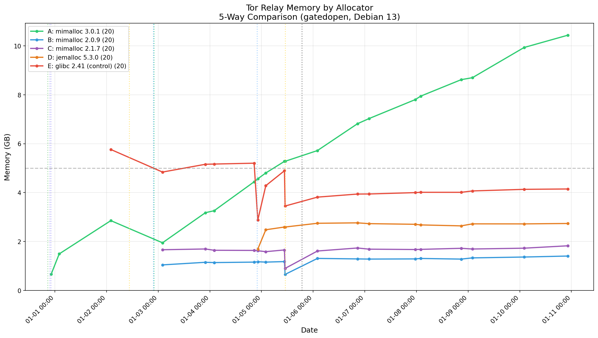
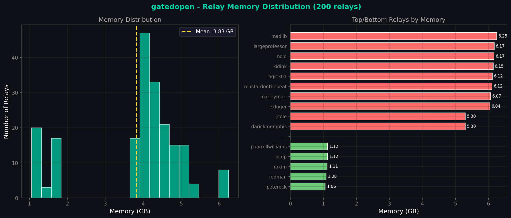
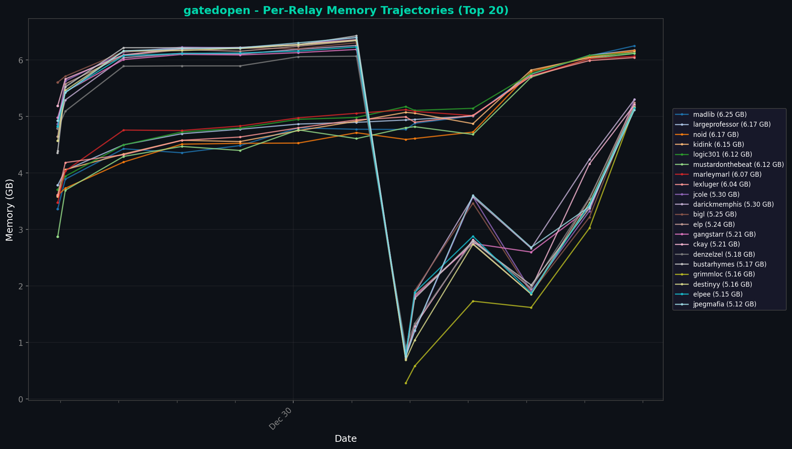

# 5-Way Memory Allocator Comparison

## Executive Summary

**Problem:** Tor relays on go server experienced severe memory bloat (~6-8 GB/relay) after mass restart, suspected to be caused by glibc malloc fragmentation  
**Hypothesis:** Alternative memory allocators (mimalloc, jemalloc) would reduce memory fragmentation and cap memory growth  
**Result:** mimalloc 2.0.9 is the clear winner, using **6.7x less memory** than mimalloc 3.0.1 and remaining stable over time. mimalloc 3.0.1 has a significant regression.  
**Recommendation:** Migrate all relays to mimalloc 2.0.9; report regression to mimalloc upstream

## Experiment Setup

| Parameter | Value |
|-----------|-------|
| Server | go.1aeo.com |
| Period | 2025-12-31 to 2026-01-08 (9 days) |
| Tor Version | 0.4.8.x (Debian 13) |
| OS | Debian 13 (trixie) |
| glibc Version | 2.41 |
| Relay Count | 200 |

### Allocators Tested

| Allocator | Version | Source |
|-----------|---------|--------|
| glibc malloc | 2.41 | System default |
| jemalloc | 5.3.0 | `apt install libjemalloc2` |
| mimalloc | 3.0.1 | `apt install libmimalloc2.0` |
| mimalloc | 2.1.7 | Custom build |
| mimalloc | 2.0.9 | Custom build |

### Groups

| Group | Allocator | Relays | Description |
|-------|-----------|--------|-------------|
| A | mimalloc 3.0.1 | 20 | Current Debian package version |
| B | mimalloc 2.0.9 | 80 | Older stable release |
| C | mimalloc 2.1.7 | 60 | Previous major version |
| D | jemalloc 5.3.0 | 20 | Alternative allocator |
| E | glibc 2.41 | 20 | Control group (system default) |

### Configuration Method

Allocators were injected via systemd service overrides using `LD_PRELOAD`:

```bash
# /etc/systemd/system/tor@RELAY.service.d/allocator.conf
[Service]
Environment="LD_PRELOAD=/usr/local/lib/mimalloc/libmimalloc-2.0.9.so"
```

## Results

### Final Metrics (Day 9 - Jan 8, 2026)

| Group | Allocator | Relays | Avg Memory | vs 3.0.1 | Status |
|-------|-----------|--------|------------|----------|--------|
| **B** | **mimalloc 2.0.9** | 80 | **1.28 GB** | **6.7x less** | ✅ STABLE |
| C | mimalloc 2.1.7 | 60 | 1.72 GB | 5.0x less | ✅ STABLE |
| D | jemalloc 5.3.0 | 20 | 2.64 GB | 3.3x less | ✅ STABLE |
| E | glibc 2.41 | 20 | 4.01 GB | 2.1x less | 📈 Growing |
| A | mimalloc 3.0.1 | 20 | 8.62 GB | baseline | ❌ BLOATING |

### Memory Growth Over Time

| Group | Day 1 | Day 3 | Day 5 | Day 7 | Day 9 | Trend |
|-------|-------|-------|-------|-------|-------|-------|
| B (mimalloc 2.0.9) | 1.03 | 1.14 | 1.18 | 1.29 | 1.28 | Flat |
| C (mimalloc 2.1.7) | 1.65 | 1.66 | 1.66 | 1.67 | 1.72 | Flat |
| D (jemalloc 5.3.0) | - | - | 2.59 | 2.70 | 2.64 | Flat |
| E (glibc 2.41) | 4.85 | 5.12 | 4.89 | 4.00 | 4.01 | Variable |
| A (mimalloc 3.0.1) | 1.93 | 3.25 | 5.28 | 7.80 | 8.62 | 📈 Growing |

### Charts


*5-way allocator comparison showing memory usage over time*


*Distribution of memory usage across relays*


*Individual relay memory trajectories*

## Analysis

### What Worked

- **mimalloc 2.0.9** demonstrated exceptional memory efficiency:
  - 6.7x less memory than mimalloc 3.0.1
  - Rock-solid stability over 9 days (no growth)
  - Consistent ~1.28 GB per relay
  
- **mimalloc 2.1.7** also performed well:
  - 5x less memory than 3.0.1
  - Stable at ~1.72 GB per relay
  
- **jemalloc 5.3.0** proved to be a viable alternative:
  - 3.3x less memory than mimalloc 3.0.1
  - Stable performance
  - Easy installation via apt

### What Didn't Work

- **mimalloc 3.0.1** (current Debian package) has severe issues:
  - Memory grows unbounded (~1 GB/day)
  - Reached 8.62 GB/relay by Day 9
  - Clear regression from 2.x series
  
- **glibc 2.41** shows expected fragmentation:
  - Variable memory usage (3.5-5 GB range)
  - Known glibc malloc fragmentation issue with Tor

### Unexpected Observations

- **mimalloc 3.0.1 regression**: The newest version performs significantly worse than older versions. This suggests a regression was introduced between 2.1.7 and 3.0.1.

- **2.0.9 vs 2.1.7**: The older 2.0.9 actually outperforms 2.1.7, suggesting the best version may be even older.

- **jemalloc viability**: While not as good as mimalloc 2.x, jemalloc is a solid choice available via standard packages.

## Root Cause

### Why mimalloc 3.0.1 Fails

mimalloc 3.0.1 appears to have a regression in how it handles long-running processes with continuous allocation/deallocation patterns (like Tor's directory caching). The memory is not being returned to the OS efficiently.

Potential causes (needs investigation):
1. Changes to segment/page management in 3.x
2. Different arena/heap strategies
3. Aggressive memory retention for performance

### Why mimalloc 2.0.9 Excels

The 2.0.x series uses simpler memory management that:
1. Returns memory to the OS more aggressively
2. Has better fragmentation resistance for Tor's allocation patterns
3. May trade some allocation speed for memory efficiency

## Recommendations

### 1. Migrate All Relays to mimalloc 2.0.9 (Secure Mode)

**Action:** Update all 200 relays to use mimalloc 2.0.9 built with `-DMI_SECURE=ON`

Building in secure mode adds guard pages, encrypted free-list pointers,
double-free detection, and allocation randomization — recovering the
heap-security mitigations lost by leaving glibc (Safe-Linking, etc.) and adding
protections glibc doesn't have. Performance overhead is ~10% on allocation
microbenchmarks, which is negligible for Tor's I/O-bound workload. See
[heap-security-review.md](../../docs/heap-security-review.md) for the full
comparison.

```bash
# Build mimalloc 2.0.9 in secure mode
wget https://github.com/microsoft/mimalloc/archive/refs/tags/v2.0.9.tar.gz
tar xzf v2.0.9.tar.gz && cd mimalloc-2.0.9
mkdir build && cd build && cmake -DMI_SECURE=ON .. && make
sudo mkdir -p /usr/local/lib/mimalloc
sudo cp libmimalloc-secure.so.2.0 /usr/local/lib/mimalloc/libmimalloc-2.0.9-secure.so

# Update systemd override for all relays
for relay in $(ls /var/lib/tor-instances/); do
    sudo tee /etc/systemd/system/tor@${relay}.service.d/allocator.conf > /dev/null <<EOF
[Service]
Environment="LD_PRELOAD=/usr/local/lib/mimalloc/libmimalloc-2.0.9-secure.so"
EOF
done
sudo systemctl daemon-reload
# Rolling restart to avoid network disruption
```

**Expected outcome:**
- Memory reduction from ~550 GB total to ~260 GB total
- Stable memory usage without growth
- ~50% memory savings
- Heap-security mitigations matching or exceeding glibc ptmalloc2

### 2. Report mimalloc 3.0.1 Regression

**Action:** Submit issue to mimalloc GitHub repository

**Report should include:**
- Reproduction environment (Tor relay, Debian 13, glibc 2.41)
- Memory growth data (1 GB/day growth)
- Comparison with 2.0.9 and 2.1.7
- Suggestion to investigate what changed in 3.x series

**Repository:** https://github.com/microsoft/mimalloc/issues

### 3. Consider Packaging mimalloc 2.0.9

For long-term maintainability:
- Create local .deb package for mimalloc 2.0.9
- Document build and installation process
- Monitor mimalloc releases for fixes

## Next Steps

- [x] Conclude experiment and document findings
- [ ] Migrate remaining 180 relays to mimalloc 2.0.9
- [ ] Submit bug report to mimalloc upstream
- [ ] Create deployment script for other servers
- [ ] Update sortaopen server with same configuration
- [ ] Monitor memory for 30 days post-migration

## Data Reference

- **Experiment directory**: `TorUtils/memory/experiments/2026-01-08-5way-allocator-comparison/`
- **Measurements**: `memory.csv` (17 data points, 200 relays)
- **Events log**: `events.csv` (12 events)
- **Diagnostics**: `diagnostics.csv`
- **Group definitions**: `groups/` directory
- **Raw data period**: 2025-12-31 to 2026-01-08

### Group Files

| File | Relays | Description |
|------|--------|-------------|
| `group_A_mimalloc301.txt` | 20 | mimalloc 3.0.1 test group |
| `group_B_mimalloc209.txt` | 80 | mimalloc 2.0.9 (current allocation) |
| `group_B_mimalloc209_historical.txt` | 20 | Original 2.0.9 test group |
| `group_C_mimalloc217.txt` | 60 | mimalloc 2.1.7 (current allocation) |
| `group_C_mimalloc217_historical.txt` | 20 | Original 2.1.7 test group |
| `group_D_jemalloc.txt` | 20 | jemalloc test group |
| `group_E_glibc.txt` | 20 | glibc control group |
| `group_E_glibc_historical.txt` | 20 | Original glibc control |

## References

1. [Tor Support: Relay Memory](https://support.torproject.org/relay-operators/relay-memory/) - Documents glibc malloc fragmentation
2. [mimalloc GitHub](https://github.com/microsoft/mimalloc) - Microsoft's compact allocator
3. [jemalloc](https://github.com/jemalloc/jemalloc) - Alternative allocator with good fragmentation handling
4. [Previous Investigation: Guard Relay Fragmentation](../reports/2025-09-18-co-guard-fragmentation/REPORT.md) - Identified glibc as root cause

---

*Experiment conducted: 2025-12-31 to 2026-01-08*  
*Report generated: 2026-01-08*  
*Author: 1AEO Team*


---

## Experiment Conclusion (January 10, 2026)

### Final Results (Day 11)

| Group | Allocator | Final Memory | vs 3.0.1 | Status |
|-------|-----------|--------------|----------|--------|
| **B** | **mimalloc 2.0.9** | **1.41 GB** | **7.4x less** | ✅ WINNER |
| C | mimalloc 2.1.7 | 1.83 GB | 5.7x less | ✅ Stable |
| D | jemalloc 5.3.0 | 2.74 GB | 3.8x less | ✅ Stable |
| E | glibc 2.41 | 4.15 GB | 2.5x less | 📈 Growing |
| A | mimalloc 3.0.1 | **10.44 GB** | — | ❌ BLOATING |

### Actions Taken

1. **Experiment concluded** - January 10, 2026
2. **Monitoring crontab disabled** - `/etc/cron.d/tor-memory-monitor.disabled`
3. **All 200 relays migrated to mimalloc 2.0.9** - Production deployment complete
4. **Final data archived** - 5,021 data points collected over 11 days

### Key Findings Confirmed

- **mimalloc 3.0.1 regression confirmed** - Grew from 1.9 GB to 10.44 GB (5.5x increase)
- **mimalloc 2.0.9 is optimal** - Stable at 1.28-1.41 GB throughout experiment
- **Memory savings realized** - Server now using ~280 GB total (was 600+ GB with mixed allocators)

*Experiment concluded: January 10, 2026*
